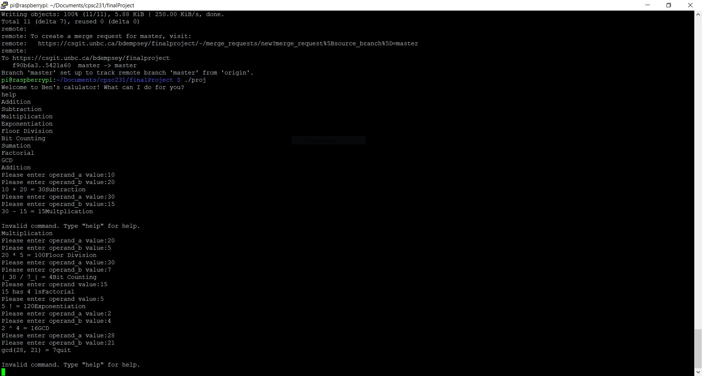
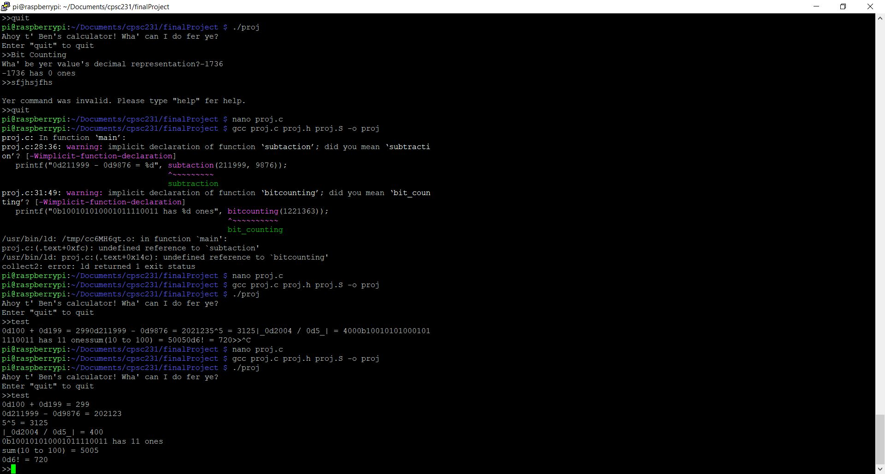

231 Final Project 
Benjamin Dempsey  
April 7, 2023  

  *PROJECT INFORMATION IS AFTER THIS SECTION*

<b> STUFF FOR BONUS MARKS </b> 
To use the calculator, type the name of they function you wish to perform or "help" for a list of instructions. 
For example, entering "Addition" will prompt the user to enter the first operand, and then the second operand. 
The program runs continuosly. Overflow is checked in C and works for all functions except Sumation and Exponentiation
 (will be fixed later).

 
Final Project Submission
 
Ben's calculatARRR is truly an innovation in the world of C programming. It features not eight, but NINE mathematical functions with enhanced quantum AI spectral pirate speak :tm:. An additional 11 commands are available including, but not limited to, "help" for more info, "quit" to quit, "info Addition" for info on addition, etc.
  
To use Ben's CalculatARRR, compile proj.S, proj.c, and proj.h together and run the executable. The screen should prompt you to enter an input. Enter "help" for a list of operations, and "info _____" to learn more about the operation and its use.
  
<b>Notes</b>
 All functions have some form of input checking except for Bit Counting. I could not think of a good way to deal with input checking, and negative inputs for Bit Counting return 0. Additionally, exponentiation's input checking is incomplete. If the base is 1, it allows any exponent. If the base is anything else it will allow an exponent as long as it is less than 32. This is valid for base 2 but will give erroneous input for bases greater than 3. If I had more time I would implement a solution similar to my Summation where each iteration of the loop in assembly is checking if the next iteration will overflow.
 
Some input checks are in C and some are in Assembly.

  
I spelled Summation as Sumation in a million places. I do not want to go back and change it. Please forgive me.
 

Here is the test output.
